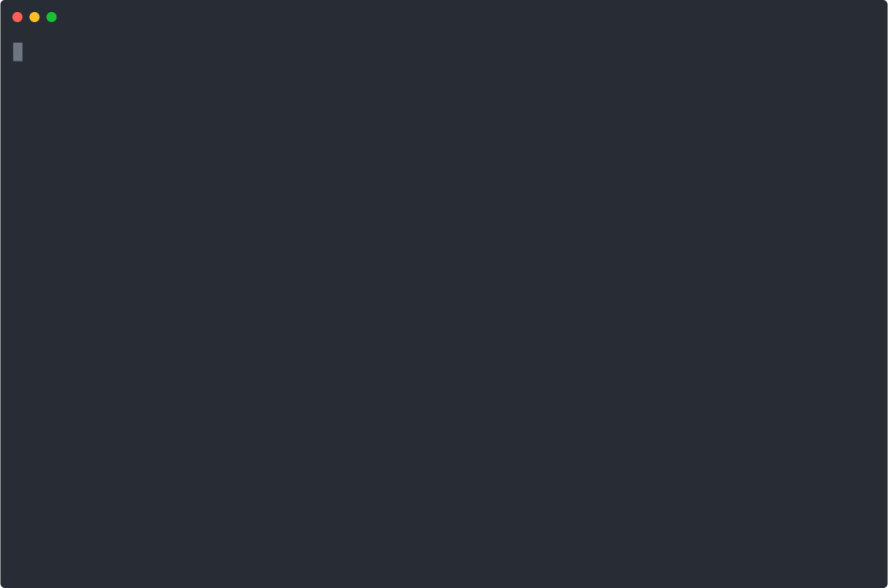

[](https://github.com/mrloop/race-cli/actions/workflows/ci.yml)
[![Latest NPM release][npm-badge]][npm-badge-url]

[npm-badge]: https://img.shields.io/npm/v/race-cli.svg
[npm-badge-url]: https://www.npmjs.com/package/race-cli


# ⚙ race-cli

CLI wrapper around [race-lib](https://github.com/mrloop/race-lib)

Retrieve data about entrants to [britishcycling.org](https://www.britishcycling.org.uk/events/results?keywords=&show=all) races ordered by national and regional ranking.

To try it out

```sh
npm install -g race-cli
race
```

```sh
yarn global add race-cli
race
```



